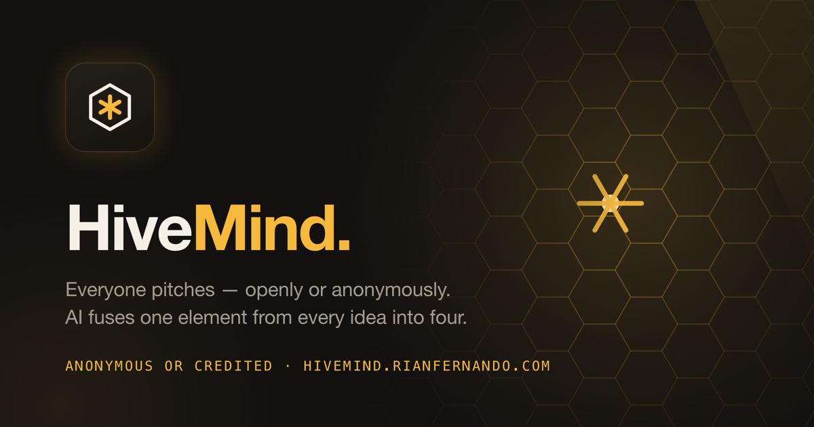
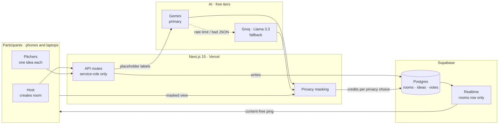
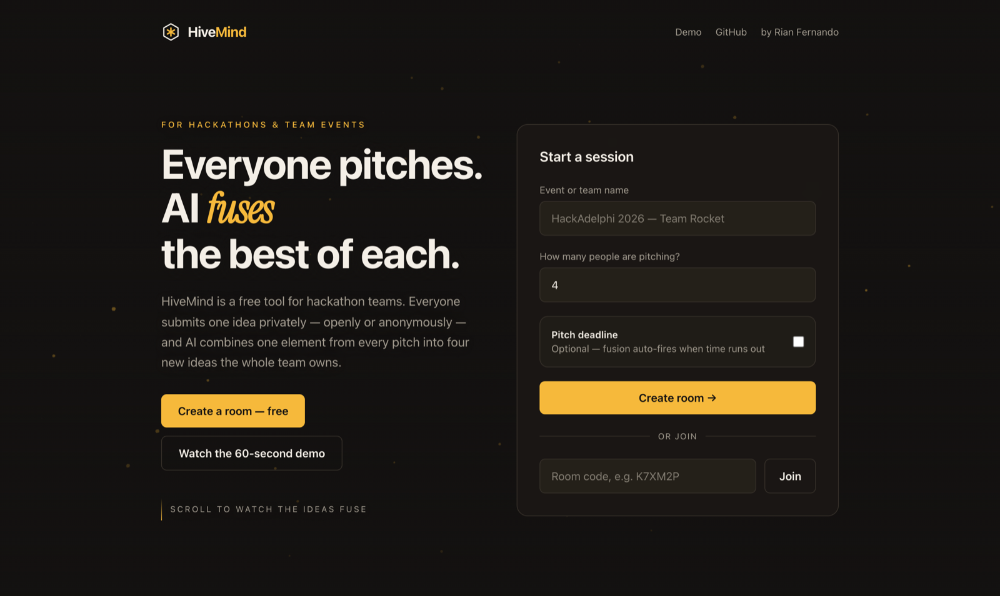
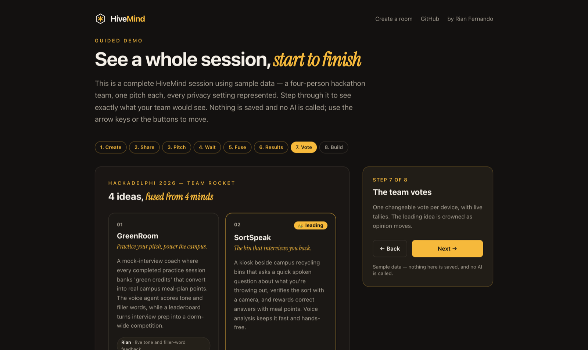
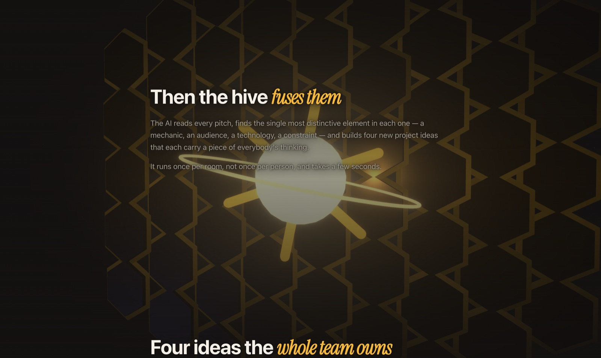

# HiveMind — group ideation, fused by AI

A group-ideation tool for hackathons that **collects every teammate's idea
privately, then fuses them.** Each person submits one pitch without seeing
anyone else's — openly or anonymously, their choice — and when the last one
lands, AI takes the single most distinctive element out of every submission and
builds four new project ideas that each carry a piece of everybody's thinking.
Then the team votes, and turns the winner into a build plan.

[](https://github.com/Rian-Fernando/HiveMind/actions/workflows/ci.yml)
[](https://github.com/Rian-Fernando/HiveMind/actions/workflows/codeql.yml)
[](LICENSE)
[](#run-it)
[](#stack--free-tiers-only)
[](https://hivemind.rianfernando.com)

**▶ Live: [hivemind.rianfernando.com](https://hivemind.rianfernando.com)** · [Guided demo](https://hivemind.rianfernando.com/demo) · [Architecture](docs/architecture.md) · [Privacy model](docs/privacy-model.md)

<!-- Tip: a short screen capture of the fusion moment at docs/demo.gif, swapped in
     below, would out-pull any still image on this page. -->


## Why it's different

Group brainstorms are decided by whoever speaks first and loudest. Every quiet
person's idea evaporates, and the team converges on the first plausible thing
said out loud. HiveMind removes the ordering problem entirely: pitches are
collected in parallel and in private, and fusion is **mechanical — every
participant's idea is required to appear in every generated concept.** The
results show which element came from whom, so nobody has to argue that they
contributed.

The part that makes people actually use it is the privacy toggle. Each person
independently decides whether their name and their pitch text are public. A
fully anonymous pitch still shapes all four results — it just never appears in
the credits. That is enforced on the server, not in the UI: the browser has no
read access to pitches at all, and the AI is handed placeholder labels instead
of hidden participants' names.

And it deliberately stops short of deciding for you. The AI produces raw
material; the team argues, votes, and commits. Nothing auto-advances past the
reveal.

## Architecture



The browser can read exactly one table (`rooms`, which holds nothing sensitive)
and write nothing. Every mutation goes through an API route holding the
service-role key. Realtime publishes only the `rooms` row, so pitch text is
never broadcast — writes bump `updated_at` as a content-free "something changed"
ping and clients refetch a masked view. Full detail in
[`docs/architecture.md`](docs/architecture.md).

## What it does

- **Rooms in one step** — name the event, set the group size (2–50), optionally
  set a pitch countdown. Share a link, a QR code, or a six-letter code.
- **Private pitching** — one idea per person, submitted without seeing the
  others. Two independent toggles hide your name, your idea text, or both.
- **Live room** — visible pitches stream in with 🔥💡😂 reactions and a progress
  bar; a countdown, when set, fires fusion automatically at zero.
- **Fusion** — one AI call per room extracts the most distinctive element of each
  pitch and combines them into four hackathon-scoped concepts, credited
  according to each person's privacy choice.
- **Voting** — one changeable vote per device, live tallies, leading idea crowned.
- **Build plans** — per idea, on demand: MVP features, a stack with reasoning, a
  role for each teammate, stretch goals, and a first-hour checklist. Cached
  room-wide, so only the first click pays for it.
- **Presenter view** — `/room/CODE/present` for a projector: a large QR code and
  live counter, then oversized result cards with live tallies.
- **Export** — copy or download the whole session as Markdown, votes and build
  plans included.





## The privacy model

| Hide name | Hide idea | In the live room | In the results |
|:---:|:---:|---|---|
| — | — | `Maya — food-waste map…` | **Maya · real-time maps** |
| ✅ | — | `Anonymous — food-waste map…` | **Anonymous · real-time maps** |
| — | ✅ | `Maya — 🔒 pitch kept private` | **Maya · secret ingredient 🤫** |
| ✅ | ✅ | `Anonymous — 🔒 pitch kept private` | *no credit at all* |

Enforced at four points: no browser read access to the `ideas` table, a masking
route for every read, placeholder labels in the AI prompt, and masking of the
AI's output *before* it is stored anywhere browser-readable. The limits of the
model are written down honestly in
[`docs/privacy-model.md`](docs/privacy-model.md) — including the fact that small
rooms leak by arithmetic and that the operator can always read raw pitches.

## Stack — free tiers only

| Layer | Choice | Free tier |
|---|---|---|
| Frontend + API | Next.js 15 (App Router), React 19 on Vercel | Hobby, free |
| Database + realtime | Supabase Postgres | 500 MB, Realtime included |
| AI — primary | Google Gemini | free API tier, no card |
| AI — fallback | Groq (Llama 3.3 70B) | free API tier, no card |
| 3D landing | three.js + React Three Fiber | open source, renders on-device |
| QR codes | `qrcode.react` | generated client-side, no service |
| Feedback | [Feedex](https://feedex.rianfernando.com) | one script tag, optional |

Nothing here bills. Fusion runs once per room and a build plan once per idea, so
a busy event costs a handful of AI calls rather than one per person. Attribution
for every third-party service is in [`NOTICE.md`](NOTICE.md).



## Run it

Two free accounts (Supabase, plus Google AI Studio and/or Groq for keys), about
ten minutes.

```bash
git clone https://github.com/Rian-Fernando/HiveMind.git
cd HiveMind
npm install
cp .env.example .env.local     # fill in the five values
npm run dev
```

**1 — Supabase.** Create a free project, open **SQL Editor → New query**, paste
[`supabase/schema.sql`](supabase/schema.sql) and run it. Copy the project URL,
the `anon` key and the `service_role` key from **Project Settings → API**.
(Upgrading an older deployment? Run
[`supabase/migration-002-features.sql`](supabase/migration-002-features.sql)
instead.)

**2 — AI keys.** [aistudio.google.com/apikey](https://aistudio.google.com/apikey)
for Gemini, [console.groq.com/keys](https://console.groq.com/keys) for Groq.
Either one alone works; with both, Groq covers Gemini's rate limit.

**3 — Run.** `npm run dev`, then open the room link in a second browser or an
incognito window to play a teammate.

**Deploy:** import the repo at [vercel.com/new](https://vercel.com/new), add the
same five environment variables, deploy. Set your custom domain as the primary
so the canonical URL and the `*.vercel.app` redirect line up.

**Feedback (optional).** Setting `NEXT_PUBLIC_FEEDEX_KEY` to a project key from
[Feedex](https://feedex.rianfernando.com) puts a feedback button on every page
except the presenter view, with browser and page context attached to each
report. Leave it unset — the default — and nothing is rendered or requested.

```bash
npm run dev        # local dev server
npm run build      # production build
npm run typecheck  # tsc --noEmit — same check CI runs
```

## Project structure

```
app/
  page.tsx                    landing — server-rendered story + FAQ, 3D backdrop
  demo/page.tsx               guided walkthrough on sample data
  llms.txt/route.ts           machine-readable summary for AI answer engines
  room/[code]/page.tsx        the room: pitch + privacy, countdown, live feed
  room/[code]/present/        presenter view for projectors
  api/rooms/route.ts          POST — create room (code + hashed host key)
  api/ideas/route.ts          POST — submit an idea (validation + privacy flags)
  api/progress/route.ts       GET  — privacy-masked pitches + reaction tallies
  api/reactions/route.ts      POST — toggle 🔥💡😂 on a visible pitch
  api/votes/route.ts          GET/POST — live tallies, one vote per device
  api/generate/route.ts       POST — race-safe fusion, Gemini → Groq, masked
  api/deepdive/route.ts       POST — build plan per idea, cached room-wide
components/
  ResultsView.tsx             results, voting, build-plan modal, export, confetti
  CreateRoomPanel.tsx         the landing page's one interactive island
  DemoWalkthrough.tsx         the demo stages
  three/HiveScene.tsx         the scroll-driven WebGL scene
  three/HiveBackdrop.tsx      mounts it — WebGL, reduced-motion and perf guards
lib/
  ai.ts                       prompts, both providers, fallback
  device.ts                   anonymous device key + room history
  supabaseAdmin.ts            service-role client (API routes only)
  supabaseBrowser.ts          anon client (reads rooms only)
supabase/
  schema.sql                  full schema for a fresh project
  migration-002-features.sql  upgrade path for earlier deployments
docs/
  architecture.md             trust boundaries, exactly-once generation, AI layer
  privacy-model.md            the four modes, enforcement points, and the limits
```

## Discoverability (SEO + GEO)

The landing page is fully server-rendered semantic HTML — the 3D scene is a
decorative, `aria-hidden` canvas behind it, dynamically imported so first load
stays around 110 kB. Search engines and AI answer engines read real content, not
an empty shell.

- `sitemap.xml`, `robots.txt`, canonical URLs, and a permanent redirect from the
  raw `*.vercel.app` host
- [`/llms.txt`](https://hivemind.rianfernando.com/llms.txt) following the
  [llms.txt convention](https://llmstxt.org), advertised in `<head>`
- Fourteen AI crawlers allowed by name — GPTBot, OAI-SearchBot, ClaudeBot,
  PerplexityBot, Google-Extended, Applebot-Extended, CCBot and others
- `SoftwareApplication`, `FAQPage` and `HowTo` structured data
- One `<h1>` per page, real landmarks, a 1200×630 PNG social image, and
  `prefers-reduced-motion` honoured across both CSS and WebGL

## License

MIT — see [`LICENSE`](LICENSE). Third-party attribution in
[`NOTICE.md`](NOTICE.md); release history in [`CHANGELOG.md`](CHANGELOG.md).

Built by [Rian Fernando](https://rianfernando.com).
