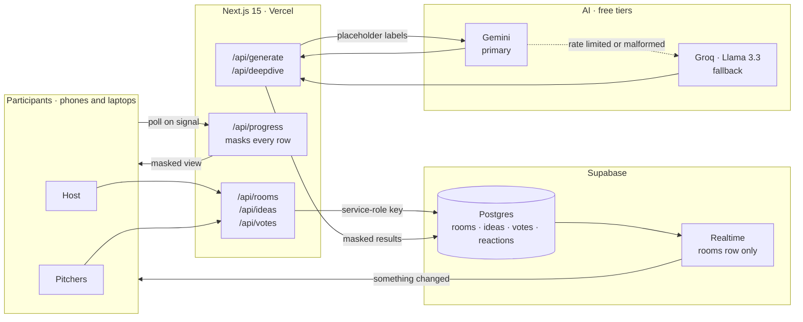
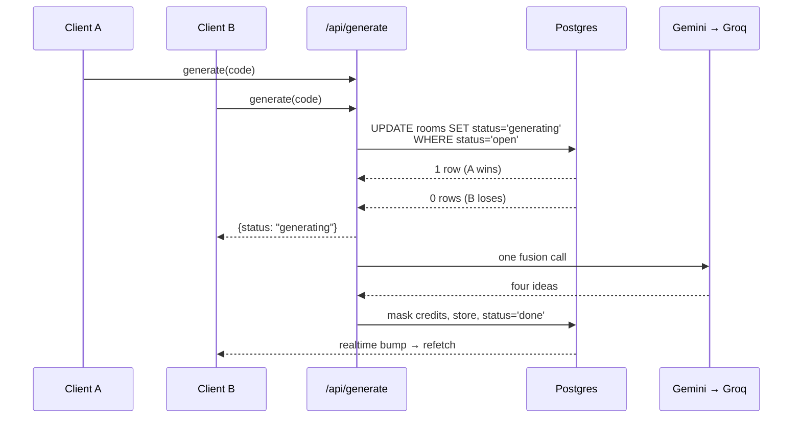

# Architecture

HiveMind is a single Next.js 15 App Router application on Vercel, backed by
Supabase Postgres, with two interchangeable AI providers. There is no separate
backend service and no build step outside `next build`.

The design constraint that shapes everything: **participants can mark their name
and their idea private independently, and those choices must hold even against
someone reading the database or the network traffic.** That is why the browser
never talks to the data layer directly for anything sensitive.

## Request flow

## Trust boundaries

| Actor | Can read | Can write |
|---|---|---|
| Browser (anon key) | `rooms` only | nothing |
| API routes (service-role key) | everything | everything |
| AI provider | pitch text with placeholder labels | — |

Row Level Security is on for every table. `rooms` has a permissive `select`
policy for the anon role because it holds nothing sensitive: the host key is
stored only as a SHA-256 hash, and `results` are already privacy-masked before
they are written. `ideas`, `votes` and `reactions` have **no** select policy at
all, so the browser cannot read them under any circumstance.

## Why Realtime only watches `rooms`

Supabase Realtime broadcasts row payloads to subscribers. Publishing the `ideas`
table would hand every connected browser the raw pitch text, defeating the
privacy model. Instead only `rooms` is published, and every write that should
wake clients up (a pitch, a reaction, a vote, a cached build plan) also bumps
`rooms.updated_at`. Clients treat that as a content-free "something changed"
signal and refetch the masked view from `/api/progress`. A five-second poll
covers dropped websockets.

## Exactly-once generation

When the last pitch lands, every connected client notices at the same moment and
fires `/api/generate`. Only one of them may actually call the AI.

The conditional update is the lock — Postgres decides the winner, so no
coordination or queue is needed. If the function crashes mid-generation the
`generating` claim goes stale after two minutes and the host can retry.

## AI layer

Both providers are called over plain REST, so there is no SDK to keep current.
Model identifiers are constants at the top of [`lib/ai.ts`](../lib/ai.ts).

- **Gemini** uses `responseSchema` constrained decoding, which guarantees
  structurally valid JSON. Prompt-only JSON instructions occasionally return
  malformed output from thinking models, which would waste the primary provider.
- **Groq** uses `response_format: json_object` and runs the identical prompt.
- Any failure of the primary — rate limit, outage, missing key, unparseable
  response — falls through to the fallback transparently. Participants never see
  which one served them; the results footer records it.

Generation runs **once per room**, and a build plan runs **once per idea** and is
cached in `rooms.results`, so a busy event costs a handful of calls rather than
one per person.

## The landing page

The landing page is server-rendered semantic HTML. The WebGL scene is a fixed,
`aria-hidden`, pointer-events-none canvas layered behind it, dynamically
imported so it never enters the initial bundle — first load stays around 110 kB
while the three.js chunks load afterwards.

The scene is driven by one number: scroll position through the story container,
normalised to 0–1. A damper eases the rendered value toward that target each
frame, so fast scrolling glides rather than snapping. Guards: WebGL capability
check, reduced quality on coarse-pointer or low-core devices, render loop paused
when the tab is hidden, and a frozen still frame under `prefers-reduced-motion`.

See [`privacy-model.md`](privacy-model.md) for the masking rules in detail.
